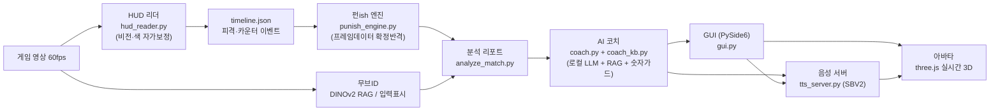

# Punish Tool

길티기어 스트라이브 리플레이를 넣으면, 그 순간 무엇을 했어야 이겼는지를 프레임 단위로 짚어 주는 로컬 AI 코치입니다. 코치는 솔 배드가이 페르소나로, 게임에서 추출한 3D 아바타를 통해 말하고 표정을 짓습니다.

바탕에 깔린 원칙은 하나입니다. **사용자에게 잘못된 정보를 주지 않습니다.** 모르면 침묵하고 지어내지 않습니다. 프레임 수치는 코드가 계산하고, LLM은 그 사실을 말로 풀어 줄 뿐입니다.

인터넷도 설치도 필요 없습니다. 전부 사용자 PC에서 오프라인으로, 무료로 동작합니다.

---

## 사용자 가이드

### 무엇을 하는 도구인가

대전격투 리플레이 영상을 넣으면, 영상을 훑어 피격·카운터·확정반격 타이밍을 자동으로 찾아냅니다. 그 사실을 바탕으로 코치가 "여기서 이걸 했어야 한다"를 짚어 주고, 같은 답변을 솔의 목소리로 말합니다. 프레임 데이터나 전략이 궁금하면 채팅으로 물어볼 수도 있습니다.

### 실행 방법

```bash
py -3.11 -m pip install -r requirements.txt
py -3.11 src/gui.py
```

이 저장소는 소스 코드입니다. 게임 에셋·모델 가중치·합성 음성은 저작권과 용량 때문에 포함되어 있지 않으므로, 해당 데이터를 갖춘 환경에서 실행해야 전체 기능이 동작합니다.

### 사용 흐름

1. **AI 코치** 탭에서 + 버튼으로 리플레이 영상을 올립니다. 분석이 끝나면 코치가 먼저 코칭을 시작합니다.
2. 궁금한 점을 채팅으로 물어봅니다. 프레임·기술·전략·매치업 등 자유롭게 대화할 수 있습니다.
3. 코치가 답하는 동안 아바타가 말하고, 답변의 감정에 맞춰 표정과 고개 제스처가 함께 나옵니다.
4. **분석** 탭에서는 AI 없이 직접 타임라인·이벤트·리포트를 살펴볼 수 있습니다.

### 음성·언어·볼륨

- 아바타 위의 **한국어 / 日本語** 버튼으로 코치 목소리 언어를 바꿉니다. 한국어는 감정까지, 일본어는 원본 성우 톤으로 나옵니다.
- 그 아래 **음량** 슬라이더로 코치 목소리 크기를 조절합니다.
- 스피커 버튼은 코치 목소리를 켜고 끕니다. 분석 영상 자체는 항상 음소거 상태로 재생됩니다.
- 앱을 처음 켜면 음성 엔진이 준비되는 데 10초 안팎 걸립니다. 그 사이 보낸 첫 질문은 소리가 조금 늦거나 생략될 수 있으며, 한 번 준비된 뒤에는 바로 나옵니다.

---

## 기술 설명

### 전체 구조



무거운 부분은 각각 별도 프로세스로 띄우고 GUI는 가볍게 유지합니다. `llm_server`가 llama.cpp를 GPU에서, `tts_server`가 SBV2를 CPU에서 맡습니다. 두 모델이 GPU를 동시에 점유하지 않도록 음성 합성은 CPU로 돌려 메모리 경합을 피합니다.

### 측정과 언어의 분리

헛소리를 막는 핵심 설계입니다. 영상에서 뽑은 사실만 LLM에 넘기고, 프레임·데미지·가드 같은 숫자는 코드가 계산한 값만 사용합니다. 시스템 프롬프트가 "참고 데이터에 없는 숫자는 만들지 마라"를 강제하고, 답변 생성 후에는 결정론적 숫자 가드가 근거 없는 수치 주장을 한 번 더 걸러 냅니다.

### 코치

로컬 LLM(qwen3:8b)을 llama.cpp로 동봉해 구동합니다. `coach_kb.py`가 번들 JSON(framedata·mechanics·combos·char_notes·move_names)에서 질문에 맞는 근거만 뽑아 넘기는 키워드 기반 검색을 담당합니다. 근거가 있으면 그것만 인용하고, 없으면 "모른다"고 답하도록 설계했습니다. 존재하지 않는 기술 표기를 받으면 비슷한 기술로 넘겨짚지 않고 실제 기본기를 안내하며 되묻습니다. 톤은 파인튜닝 대신 페르소나와 few-shot 예시로 고정했습니다. 과거 파인튜닝은 자유대화를 손상시켜, 베이스 모델과 코드 가드의 조합으로 정착했습니다.

### 음성

Style-Bert-VITS2를 한국어로 개조했습니다. 언어 의존 부분인 G2P와 BERT를 교체하고, AI Hub 코퍼스로 한국어 기반모델을 학습한 뒤 게임에서 추출한 솔의 대사로 파인튜닝했습니다. 감정 표현은 솔의 전투·스토리 음성에서 뽑은 스타일 벡터로 만들어, 화날 때는 전투 톤, 다독일 때는 차분한 톤으로 답변 감정에 맞춰 바뀝니다. 음질을 해치는 후처리(pitch 변형)는 쓰지 않고, 스타일과 속도만으로 감정을 실었습니다. 일본어는 원본 성우 음성으로 별도 모델을 학습해 토글로 전환합니다.

### 아바타

게임 3D 모델을 three.js로 실시간 구동합니다. 눈꺼풀·눈썹·볼·콧방울·입술 리그로 표정을 만들고, 깜빡임과 립싱크를 함께 처리합니다. 감정 제스처(끄덕임·고개젓기 등)는 음성이 재생되는 동안 같이 진행됩니다. 코치가 생각할 때는 팔을 2본 IK로 풀어 턱에 주먹을 괴는 포즈를 잡고, 대기 상태와 부드럽게 전환됩니다.

### 코드 구성

| 갈래 | 파일 |
|---|---|
| 분석 | `hud_reader.py`, `punish_engine.py`, `analyze_match.py` |
| 코치 | `coach.py`, `coach_kb.py`, `llm_server.py` |
| 음성 | `tts_server.py`, `tts_client.py`, `tts_synth.py`, `tts_train.py`, `tts_prep.py`, `tts_warmstart.py` |
| 아바타 | `avatar3d.py`, `avatar3d/index.html` |
| GUI | `gui.py` |

한국어 개조·감정 스타일·아바타 표정 엔진의 상세 설계는 [프로젝트 설명서](제출물/프로젝트_설명서.md)에, 코치 평가(RAGAS 실측)는 [평가 리포트](제출물/평가_리포트.md)에 정리되어 있습니다.

---

## 라이선스·고지

비영리 교육·연구 목적입니다. Guilty Gear Strive와 솔 배드가이 관련 자산·음성은 Arc System Works의 지식재산이며, 상업적으로 이용하지 않습니다. 아바타는 게임 모델 추출, TTS는 게임 내 음성 기반 합성이므로, 배포 시 "게임 음성 기반 합성(연구·교육용)"임을 명시합니다.
