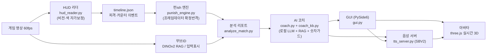

# Punish Tool

길티기어 스트라이브 리플레이를 넣으면, 그 순간 뭘 했어야 이겼는지 프레임 단위로 짚어주는 로컬 AI 코치. 코치는 솔 배드가이 페르소나고, 게임에서 뽑은 3D 아바타로 말하고 표정을 짓는다

바탕에 깔린 원칙 하나 — **사용자에게 잘못된 정보를 주지 않는다**. 모르면 침묵하고, 지어내지 않는다. 프레임 수치는 코드가 계산하고 LLM은 그 사실을 말로 풀어줄 뿐이다

인터넷도 설치도 필요 없다. 전부 사용자 PC에서 오프라인으로, 무료로 돈다

---

## 어떻게 도는지



영상을 훑어 피격·카운터·확정반격 타이밍을 뽑고, 그 사실만 코치에게 넘긴다. 코치가 대화로 풀어주면, 같은 답변을 솔 목소리로 합성해 아바타가 말한다. 무거운 부분(LLM, 음성 합성)은 각각 별도 프로세스로 띄우고 GUI는 가볍게 유지한다 — llm_server가 llama.cpp를, tts_server가 SBV2를 맡는 구조

## 무엇이 들어있나

- **측정과 언어의 분리** — 영상에서 뽑은 사실만 LLM에 넘긴다. 프레임 수치는 결정론적 가드가 지키고, 모델이 숫자를 스스로 지어낼 수 없다(프롬프트 강제 + 코드 검증)
- **말하는 코치** — 코치 답변을 솔 목소리로 실시간 합성해 재생한다. 답변의 감정을 읽어 톤을 바꾼다. 화낼 땐 전투 톤, 다독일 땐 차분한 톤
- **한국어 음성** — Style-Bert-VITS2를 한국어로 개조(G2P·BERT 교체). AI Hub 코퍼스로 기반모델을 올린 뒤, 게임에서 추출한 솔 대사로 파인튜닝. 감정 스타일은 솔의 전투·스토리 음성에서 뽑았다
- **일본어 음성** — 원본 성우 목소리로 파인튜닝한 별도 모델. 앱에서 한국어/일본어 토글
- **표정 짓는 아바타** — 게임 3D 모델을 three.js로 실시간 구동. 눈꺼풀·눈썹·볼·입 리그로 감정을 만들고, 생각할 땐 팔을 IK로 풀어 턱에 주먹을 괴는 포즈까지 잡는다
- **완전 로컬** — 동봉한 llama.cpp(qwen3:8b)와 음성 서버가 127.0.0.1에서 돈다. 외부 API 호출 없음, 비용 0

## 빠른 시작

이 저장소는 소스 코드다. 게임 에셋·모델 가중치·합성 음성은 저작권과 용량 때문에 빠져 있으니, 자기 환경에서 데이터를 갖춘 뒤 돌려야 한다

```bash
py -3.11 -m pip install -r requirements.txt
py -3.11 src/gui.py
```

음성을 실제로 들으려면 SBV2 환경(`tts/sbv2_env`)과 파인튜닝 체크포인트가 필요하다. 없으면 아바타는 입만 움직이고 소리는 나지 않는다 — 코치의 텍스트 코칭은 그대로 동작한다

## 코드 구성

| 갈래 | 파일 |
|---|---|
| 분석 | `hud_reader.py`, `punish_engine.py`, `analyze_match.py` |
| 코치 | `coach.py`, `coach_kb.py`, `llm_server.py` |
| 음성 | `tts_server.py`, `tts_client.py`, `tts_synth.py`, `tts_train.py`, `tts_prep.py`, `tts_warmstart.py` |
| 아바타 | `avatar3d.py`, `avatar3d/index.html` |
| GUI | `gui.py` |

한국어 개조·감정 스타일·아바타 표정 엔진의 자세한 설계는 [프로젝트 설명서](제출물/프로젝트_설명서.md)에 있다. 코치 평가(RAGAS 실측)는 [평가 리포트](제출물/평가_리포트.md), 페르소나 정의는 [페르소나 카드](제출물/페르소나_카드.md)

## 라이선스·고지

비영리 교육·연구 목적. Guilty Gear Strive와 솔 배드가이 관련 자산·음성은 Arc System Works의 지식재산이며, 상업적으로 이용하지 않는다. 아바타는 게임 모델 추출, TTS는 게임 내 음성 기반 합성이라 배포 시 "게임 음성 기반 합성(연구·교육용)"임을 명시한다
