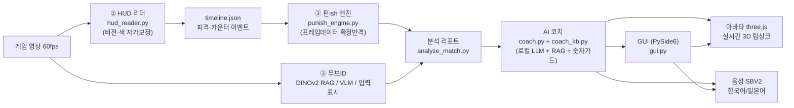

# Punish Tool — 길티기어 스트라이브 AI 코치 (AI 휴먼 "솔 배드가이")

> 대전격투 게임 리플레이를 넣으면, **AI 휴먼 솔 배드가이**가 "그 순간 뭘 했어야 이겼는지"를
> 프레임 단위로 짚어 주는 로컬·오프라인 코칭 도구.
> **제1원칙: 사용자에게 잘못된 정보를 주지 않는다 — 모르면 침묵, 거짓말은 금지.**

---

## 한 줄 요약

게임 영상(60fps)을 훑어 **피격·카운터·확정반격 타이밍**을 자동으로 찾아내고, 그 사실을
**로컬 LLM 코치(솔 배드가이 페르소나)**가 대화로 풀어 준다. 여기에 **3D 아바타 + 한국어 TTS**를
붙여 "말하고 표정 짓는 코치"를 지향한다. 전부 사용자 PC에서 오프라인·무료로 동작.

## 핵심 특징

- **측정 → 언어 분리 아키텍처**: 영상에서 뽑은 *사실*만 LLM에 넘긴다. LLM은 프레임 수치를
  스스로 지어낼 수 없다(프롬프트 강제 + 결정론적 숫자 가드).
- **완전 로컬·오프라인**: llama.cpp 동봉(qwen3:8b), Ollama·인터넷·설치 불필요.
- **멀티모달**: 비전(HUD 자가보정·무브ID), 음성(SBV2 한국어 TTS), 아바타(three.js 실시간 3D).
- **한국어 특화 TTS**: NDC26(넥슨게임즈) 방식을 따라 Style-Bert-VITS2를 **한국어로 개조**.

## 빠른 시작

```bash
# 배포본 실행 (설치·터미널 불필요)
dist/FrameAnalyzer/  ->  프레임분석기_실행.bat 더블클릭

# 개발 환경
py -3.11 -m pip install -r requirements.txt
py -3.11 src/gui.py
```

## 아키텍처 (한눈에)



## 산출물 맵 (과제 트랙 대응)

| 트랙 | 이 프로젝트의 결과물 |
|---|---|
| 기획 | 페르소나(솔 배드가이)·도메인 카드(GGST), [프로젝트 설명서](프로젝트_설명서.md) |
| 데이터 | `framedata/mechanics/combos/char_notes/char_stats/move_names` JSON, RAG 벡터DB(`rag_*.npz`), TTS 데이터셋(SOL·SOL_JP·base_ko) |
| AI 엔진 | 근거기반 RAG 코치(`coach.py`/`coach_kb.py`), 시스템 프롬프트, 숫자 가드, 파인튜닝 실험 리포트 |
| 백엔드 | 동봉 llama.cpp 서버 관리(`llm_server.py`), OpenAI 호환 API |
| 클라이언트 | PySide6 GUI(`gui.py`) — 채팅 + 분석 탭 |
| 멀티모달 | 비전(HUD·무브ID), 음성(SBV2 TTS), 아바타(three.js 3D) |
| 인프라 | 통짜 배포(`dist/`, `FrameAnalyzer.spec`), 실행 배치 |
| 문서 | [최종 보고서](프로젝트_최종보고서.html), [시연 시나리오](시연_시나리오.md), [소스/링크 정리](GitHub_링크정리.md) |

## 문서 (과제 산출물)

- 📘 [프로젝트 설명서](프로젝트_설명서.md) — 모듈·데이터·실행법 상세
- 📊 [프로젝트 최종 보고서](프로젝트_최종보고서.html) — 발표용 슬라이드 덱 (브라우저로 열기, 음성·차트 포함)
- 🎬 [프로젝트시연_동영상.mp4](프로젝트시연_동영상.mp4) — 30초 시연영상 (실제 앱 화면 + 자막 + 솔 음성)
- 🎭 [페르소나 카드](페르소나_카드.md) — 솔 배드가이 코치 정의
- 📈 [평가 리포트](평가_리포트.md) — RAGAS 정렬 실측 (Faithfulness 1.00)
- 💰 [호출 로그 요약](호출_로그_요약.md) — 엔진·비용($0)·TTFB
- 🎬 [시연 시나리오](시연_시나리오.md) — 데모 영상 스토리보드(≤10분)
- 🪞 [회고서](회고서.md) · [자기평가서](자기평가서.md)
- 🔗 [GitHub 링크·샘플소스 정리](GitHub_링크정리.md)

## 라이선스·고지

비영리 교육 목적. Guilty Gear Strive 및 솔 배드가이 관련 자산·음성은 Arc System Works의
지식재산이며, 본 프로젝트는 이를 상업적으로 이용하지 않는다. 아바타는 게임 모델 추출,
TTS는 게임 내 음성 기반 합성이므로 배포 시 "게임 음성 기반 합성(연구·교육용)"을 명시한다.
