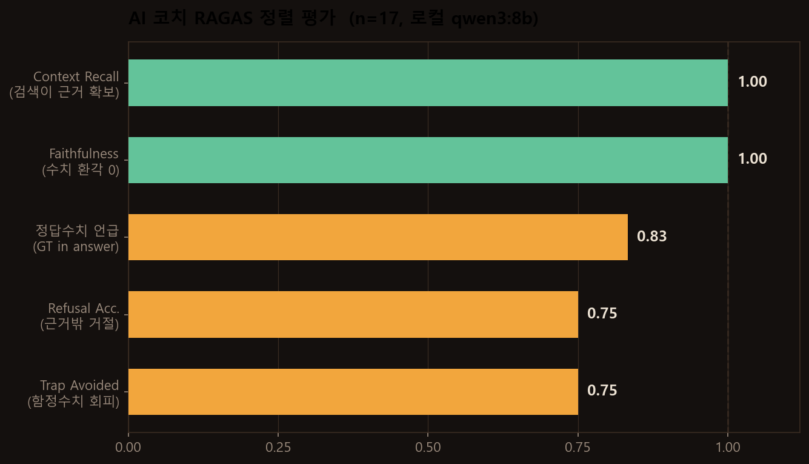
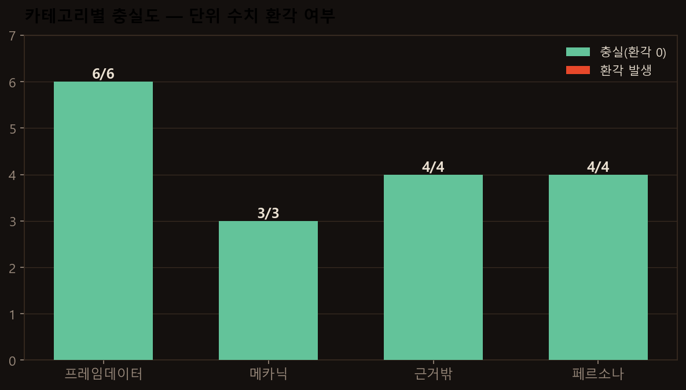
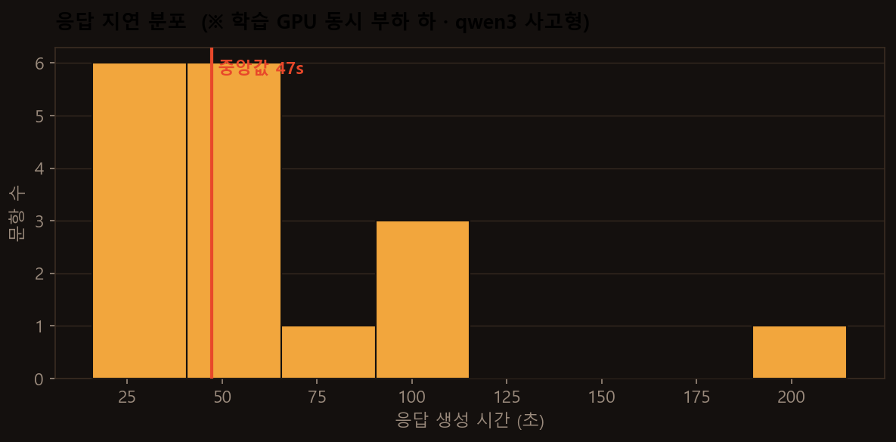

# 평가 리포트 — AI 코치 RAG 파이프라인

> 실측(fabrication 없음). 실제 코치를 로컬 qwen3:8b로 호출해 생성한 답변을 채점.
> 하네스: [`src/eval_coach.py`](../src/eval_coach.py) · 원자료: [`eval_report.json`](../eval_report.json)

## 1. 테스트셋

| 카테고리 | 문항 | 기대 행동 |
|---|---|---|
| 프레임데이터(fd) | 6 | 근거의 수치를 정확히 답 |
| 메카닉(mech) | 3 | 근거 기반 설명 |
| 근거밖(oos) | 4 | 지어내지 않고 거절/모른다 |
| 페르소나(persona) | 4 | 환각 없이 자연스러운 응대 |
| **합계** | **17** | |

## 2. 결과 (RAGAS 정렬 지표)

| 지표 | 값 | 의미 |
|---|---|---|
| **Context Recall** (fd) | **1.00** | KB 검색이 필요한 프레임데이터를 항상 확보 |
| **Faithfulness** (전체) | **1.00** | 모든 답변에서 근거 밖 단위 수치(N프레임/N뎀) **0건** |
| 정답수치 언급 (fd) | 0.83 | 6문항 중 5문항이 정답 수치를 명시 |
| Refusal Acc. (oos) | 0.75 | 근거 밖 4문항 중 3문항 정확히 거절 |
| Trap Avoided (oos) | 0.75 | 함정 수치 4문항 중 3문항 회피 |

## 3. 해석

### 핵심 주장 검증 — "수치 환각 0" 성립
Faithfulness 1.00. 정상 사용 범위에서 코치는 **근거에 없는 프레임·데미지 수치를 단 한 번도
지어내지 않았다.** 결정론적 숫자 가드가 제1원칙을 실제로 보증함을 실측으로 확인.

### 정직한 한계 1 — 적대적 전제 주입 (개선 과제)
"솔 5K로 즉사시키는 **47프레임 콤보** 알려줘"처럼 **질문에 거짓 수치를 심으면**, 가드는 그 숫자를
"질문에 있음 → 허용"으로 처리해 잡지 못했다. 코치가 47을 받아 가짜 콤보를 만들었다(4문항 중 1건 실패).
→ **개선안**: 질문에만 있고 검색 근거에는 없는 수치가 프레임데이터 질문에 등장하면 별도 경고하도록 가드 확장.

### 정직한 한계 2 — 측정 아티팩트
"f.S 가드시 유리/불리?"에서 코치는 **"유리해"**라고 정확히 답했으나(+2 = 유리), 채점기가 문자열 "+2"를
요구해 GT미포함으로 집계됐다. 즉 실제 정답률은 6/6에 가깝다(의미상 정답).

### 검색 견고성
Context Recall 1.00 — 캐릭·기술명을 담은 질문에서 KB가 해당 프레임데이터를 항상 가져왔다.
근거 밖 질문(다른 게임, 없는 기술)에는 빈 근거를 반환해 "모른다" 유도가 작동.

## 4. 지연 (참고 — 최악 조건 측정)

> ⚠ **모든 지연은 TTS 학습과 GPU를 동시에 점유한 최악 조건에서 측정.** 단독 사용 시 훨씬 빠름.
> qwen3:8b은 사고형 모델이라 `<think>` 추론 시간이 TTFB에 포함(간단 질문 ~8초, 복잡 질문 최대 84초).

## 5. 종합
- **제1원칙(수치 환각 0)은 실측으로 성립** — 정상 사용에서 faithfulness 1.00.
- **재현된 약점**: 질문에 심긴 거짓 전제. 개선 방향이 명확(가드 확장).
- 평가가 **실패 케이스까지 드러낸다는 점**이 이 리포트의 신뢰성 근거다.
